## Summary
On June 12, 2023, Sturdy Finance was hacked on Ethereum Mainnet. The hackers were able to exploit a vulnerability in the protocol’s borrowing pool, which allowed them to steal around $800K worth of ETH.

## About Project
Sturdy Finance is a decentralized finance (DeFi) protocol that allows users to borrow and lend assets without paying interest. Instead of charging borrowers interest, Sturdy stakes their collateral and passes the yield to lenders. This model changes the relationship between borrowers and lenders to make Sturdy the first positive-sum lending protocol.

To learn more about the Project, check out the official [documentation](https://docs.sturdy.finance/overview/what-is-sturdy).

# Vulnerability Analysis & Impact:
## On-Chain Details

`Attacker Address` : [0x1e8419e724d51e87f78e222d935fbbdeb631a08b](https://etherscan.io/address/0x1e8419e724d51e87f78e222d935fbbdeb631a08b)

`Attack Transaction` : [0xeb87ebc0a18aca7d2a9ffcabf61aa69c9e8d3c6efade9e2303f8857717fb9eb7](https://etherscan.io/tx/0xeb87ebc0a18aca7d2a9ffcabf61aa69c9e8d3c6efade9e2303f8857717fb9eb7)

`Attack Contract` : [0x0b09c86260c12294e3b967f0d523b4b2bcdfbeab](https://etherscan.io/address/0x0b09c86260c12294e3b967f0d523b4b2bcdfbeab)

`Sturdy Contract which was exploited` : [0x46beA99d977F269399fB3A4637077bB35F075516](https://etherscan.io/address/0x46bea99d977f269399fb3a4637077bb35f075516#code)

## The Root Cause
The root cause of the exploit was a read-only reentrancy present in Balancer's `PoolBalances.sol` smart contract.
The vulnerable function was `_joinOrExit(...)` which was marked protected with `non-Reentrant` modifier but was still vulnerable. Since there was an external call involved in the function, this caused the exploit to happen.

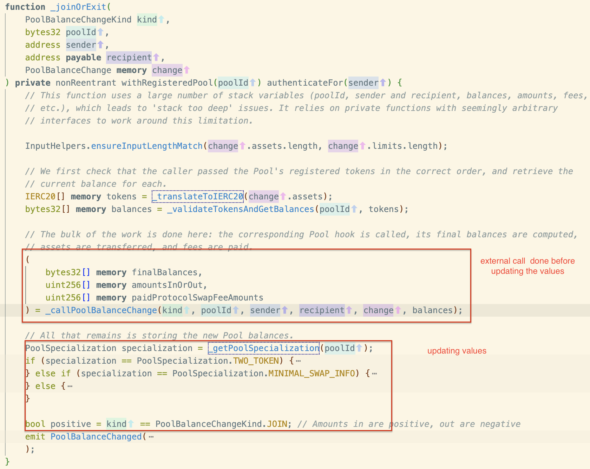

## Attack Process

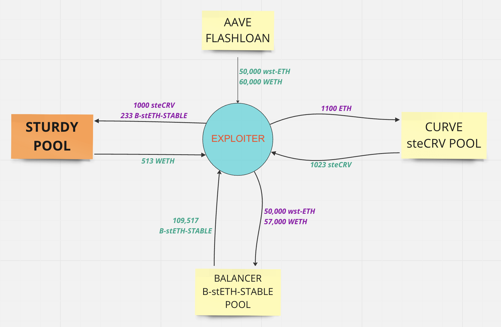

__1. Attacker took a flashLoan of 50,000 `wstETH` and 60,000 `WETH` from AAVE.__
<br>
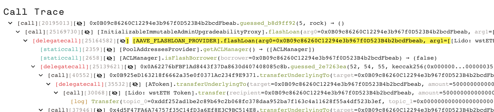
<br><br><br>

__2. Attacker minted 1023 `steCRV` tokens using `Curve steCRV` Pool by depositing 1100 `ETH`__
<br><br>
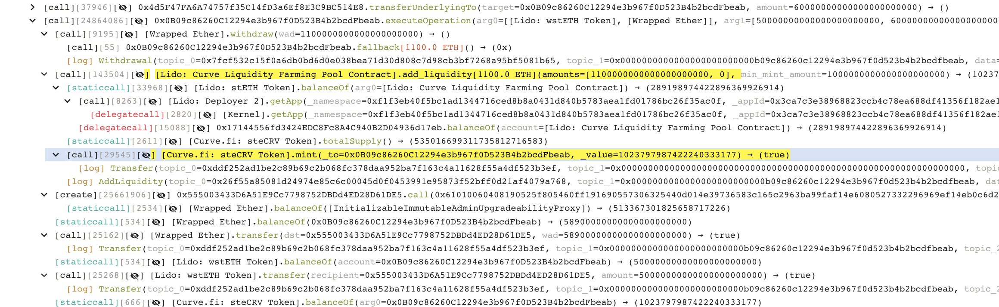<br><br><br>

__3. 109,517 `B-stETH-STABLE` tokens were also minted by depositing 50,000 `wstETH` and 57,000 `WETH` in Balancer Pool.__
<br>
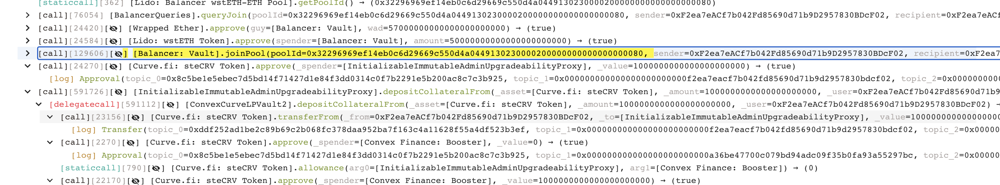<br><br><br><br>
__4. Attacker borrowed 513 WETH from Sturdy Lending Pool using two tokens as collateral.__
- __1000 `steCRV`__<br>
- __233 `B-stETH-STABLE`__
    <br><br>
    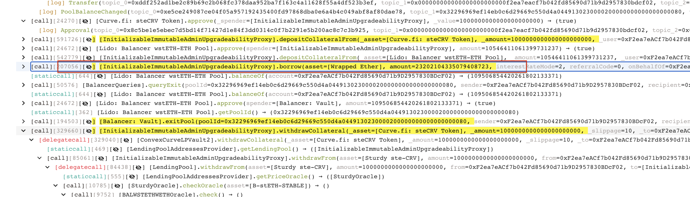
<br><br><br>

__5. Increase the price of the `B-stETH-STABLE`, so that `steCRV` can be set as non collateral. Since now the price of `B-stETH-STABLE` is increased, `PoolBalances.sol/exitPool()` is called.__
<br><br>
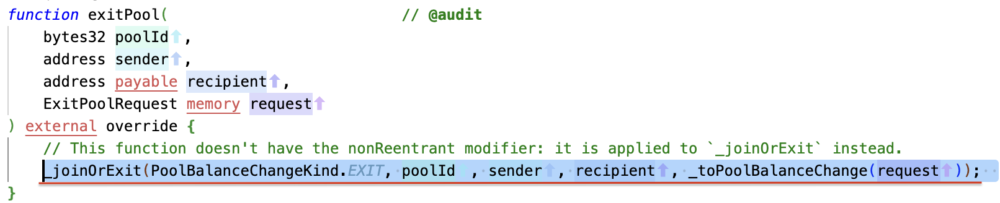
<br><br><br>
__This function calls `PoolBalances._joinOrExit()`function which is vulnerable to read only vulnerability and does an external call indirectly.__
<br><br>
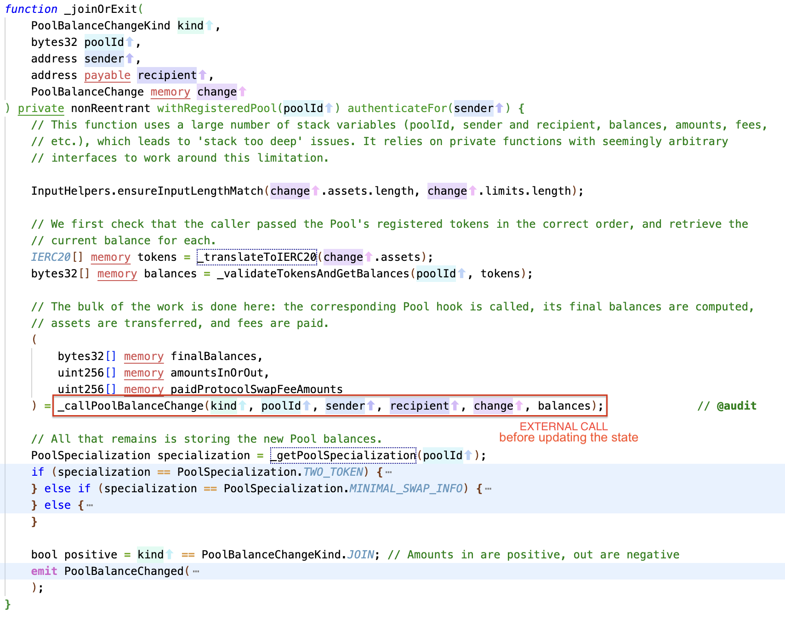
<br><br>
__further call-graph is as follows :__
```
PoolBalances._joinOrExit() --> PoolBalances._callPoolBalanceChange() --> AssetTransferHandler._sendAsset() --> Address.sendValue()
```
__sendValue() is the function using the solidity native call.__
<br><br>
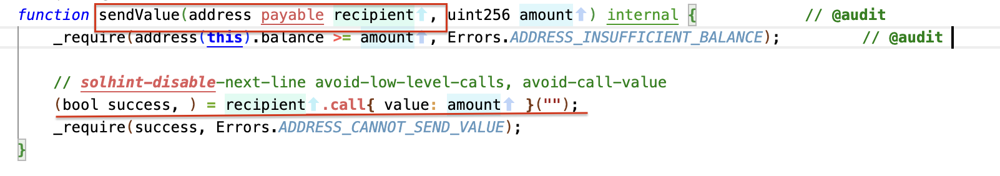
<br><br>
The call made by the function then used by fallback of the malacious contract to call Sturdy contract `LendingPool.setUserUseReserveAsCollateral()` to set the `steCRV` as non-collateral as after the price manipulation, the protocol considers that only 233 `B-stETH-STABLE` are able to cover the debt.
This function then calls the read function `SturdyOracle.getAssetPrice()` which gives false output due to the reentrancy present in the function we discussed above 
The false output is due to the fact that the value comes directly from the Balancer `PoolTokens.getPoolTokens()` contract.

__7. Withdraw the 1000 `steCRV` tokens from pool.__
<br><br>
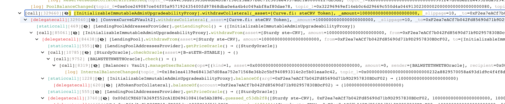
<br><br>

__8. Now, since the price of `B-stETH-STABLE` has come to normal, liquidate the position in Sturdy Pool with 236`WETH` to get back 233`B-stETH-STABLE`.__
<br><br>
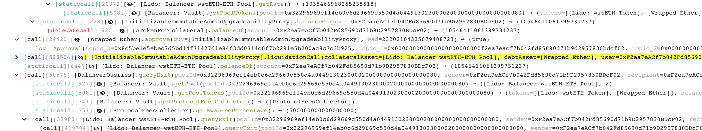
<br><br>
__9. Give the FlashLoan back.__

`
Steps 3-8 are repeated 5 times
and are contained in in the exploiter contract as a single function maybe named as "yoink()"
This function is called 5 times and contains the logic for steps 3-8.
`
<br>
## Flow of Funds
Immediately after the exploit the exploiter sent the funds to the tornado cash. So, the current owner of the funds is unknown.

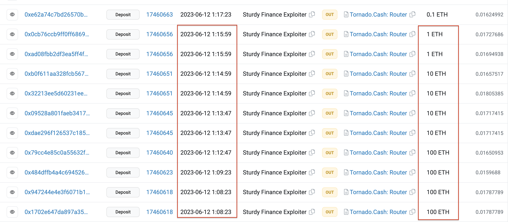


## Value impact on the protocol 

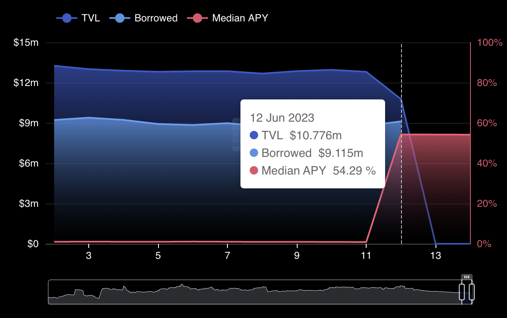
Source : [DefiLlama](https://defillama.com/protocol/sturdy?borrowed=true&medianApy=true&usdInflows=true)


## Incident Timelines

On the same day of exploit (June 12, 2023) : Sturdy Finance acknowledged the exploit and tweeted:

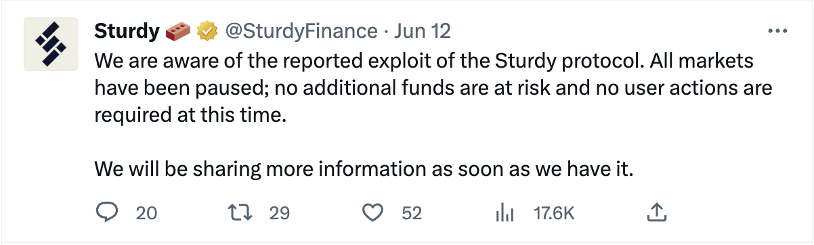
[go to tweet](https://twitter.com/SturdyFinance/status/1668080627030315009)

They also published a report related to the exploit on June 14, 2023.
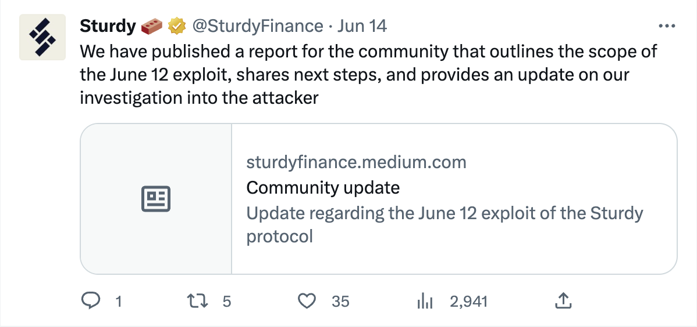
[go to tweet](https://twitter.com/SturdyFinance/status/1668768164610740225)

## How they could have prevented the Exploit?
- Proper implementation of the function doing external call should be done.
- Tests covering each and every possibility should be written.
- There should be consistency while viewing the state of the blockchain through any source.
- Functions viewing the state of blockchain should utilize more than one source.